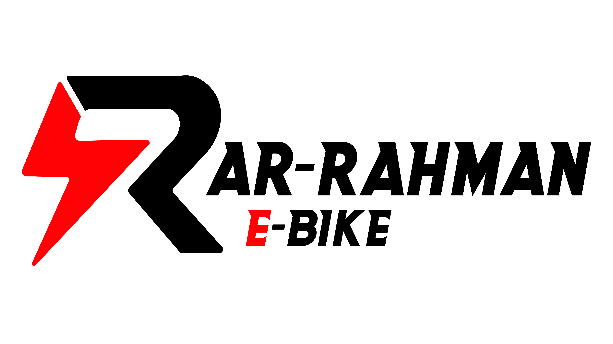

<p align="center">
  
</p>

<h1 align="center">STAR SEPEDA LISTRIK BONDOWOSO</h1>

<p align="center">
  Website e-commerce penjualan sepeda listrik terpercaya di Bondowoso, Jawa Timur.<br>
  <strong>Tech Stack:</strong> Laravel 11 + Bootstrap 5 + MySQL
</p>

---

## 🚀 Fitur

### Landing Page
- Homepage dengan Hero Section, Produk, Testimoni, dan Kontak
- Filter dan tampilan produk lengkap
- Tracking klik produk (untuk analitik)
- SEO-optimized dengan meta tags lengkap
- Responsive design
- WhatsApp Integration untuk pemesanan

### Admin Panel
- Dashboard dengan statistik produk dan klik
- Manajemen produk (CRUD)
- Ganti PIN admin
- Login dengan sistem PIN 4 digit

---

## 🛠️ Tech Stack

- **Framework:** Laravel 11
- **Frontend:** Bootstrap 5, Font Awesome 6
- **Database:** MySQL
- **Design:** Custom responsive design
- **Icons:** Font Awesome 6.6.0

---

## 📦 Installation

```bash
# Clone repository
git clone https://github.com/ardhikaxx/web-star-electric.git

# Install dependencies
composer install
npm install

# Copy environment file
cp .env.example .env

# Generate key
php artisan key:generate

# Run migration
php artisan migrate

# Seed data (optional)
php artisan db:seed --class=AdminSettingSeeder

# Run server
php artisan serve
```

---

## 👤 Default Credentials

| Item | Value |
|------|-------|
| PIN Admin | `1234` |
| WhatsApp | `+62 852-3126-0016` |

---

## 📂 Project Structure

```
web-star-electric/
├── app/
│   ├── Http/Controllers/
│   │   ├── Admin/          # Admin controllers
│   │   └── LandingController.php
│   └── Models/
│       ├── AdminSetting.php
│       └── Product.php
├── database/
│   ├── migrations/
│   └── seeders/
├── public/
│   └── assets/             # Images, logos
├── resources/
│   └── views/
│       ├── admin/          # Admin panel views
│       ├── index.blade.php # Landing page
├── routes/
│   └── web.php
└── .env
```

---

## 📱 Screenshots

### Landing Page
- Hero section dengan call-to-action
- Daftar produk lengkap
- Halaman testimoni
- Peta lokasi toko

### Admin Panel
- Dashboard statistik
- Manajemen produk
- Ganti PIN

---

## 📞 Kontak

| Channel | Info |
|---------|------|
| Alamat | Jl. Raya Pakisan No.51, Krasak, Maskuning Kulon, Kec. Pujer, Kabupaten Bondowoso, Jawa Timur 68271 |
| Telepon | +62 852-3126-0016, +62 813-3197-8800 |
| WhatsApp | [Chat via WhatsApp](https://wa.me/6285231260016) |

---

## 📝 Lisensi

MIT License - Copyright © 2026 STAR SEPEDA LISTRIK BONDOWOSO

---

<p align="center">Made with ❤️ for STAR SEPEDA LISTRIK Bondowoso</p>